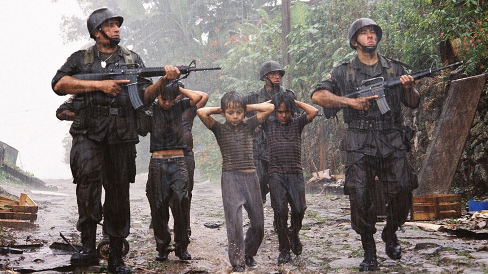

```{r image, echo=FALSE, fig.align='center'}

```


```{r setup, include=FALSE}
knitr::opts_chunk$set(echo = TRUE)
```


```{r include=FALSE}
library(dplyr)
library(ggplot2)
library(forcats)
library(janitor)
library(corrr)


```

## Introduction

For my creative project I wanted to analyze Guatemala's and El Salvador's terrorist attacks. Considering the Tattooed Soldiers discusses in great lengths the Civil Wars happening in both countries, I decided to analyze the congruent information we have. I gathered my data from Kaggle, link provided below, where they gather the information from Global Terrorism Database. Since the data can sometimes be limited due to lack of record documentation in Latin American, I was also gather some information from my parents who lived through this crisis. 

<https://www.kaggle.com/code/josutk/identifying-patterns-of-terrorist-attacks/notebook>

```{r}
GT<-read.csv("globalterrorismdb_0718dist.csv")
```

## Clean-Up Data

Our data is nationwide so we will tidy it to only display attacks that happened in Guatemala and El Salvador. Also, there's around 135 variables, many of which are redundant or unnecessary for our analysis so we will scrape them. Just to make our visuals clearer, I merged some of the terrorist groups together into an 'Other' category because there were few times this group attacked compared to other groups. At the end, we remain with 26 variables.

```{r}
#only use data from Guatemala and El Salvador
#region 2= carribean and latin america
GT<-GT %>%
  filter(region=='2', country_txt=='Guatemala'|country_txt=='El Salvador')

#removing columns
GT<-GT[ , colSums(is.na(GT))<.1] 

#factor
GT$gname<- fct_lump_min(GT$gname, min=15, other_level = "Other")

GT<-GT[c(1,2,3,4,6,8,9,12,13,23,24,26,27,30,31,33,45,57,58,59,66,67,68,70,72,74)] #predictors to keep
#only 28 variables remaining

#turn into characters
GT$eventid<-as.character(GT$eventid)
GT$imonth<-as.character(GT$imonth)
GT$iyear<-as.character(GT$iyear)
GT$iday<-as.character(GT$iday)
GT$country<-as.character(GT$country)
GT$ishostkid<-as.character(GT$ishostkid)

```
### Defining our Variables

My variables are as follows:

`eventid`: a 12-digit number assigned by a system dedicated to identify each attack. The first 8 digits is the date recorded, YYYYMMDD, while the last 4 digits is the sequential. 

`iyear`: the year the attack occurred.

`imonth`: the month the attack occurred.

`iday`: the day the attacked occurred.

`extended`: whether the duration of the incident lasted for over 24 hours. (e.g 1=Yes, 0=No)

`country`: the country code where the incident occurred. 

`country_txt`: the name of the country or location where the attack occurred.

`provstate`: the province or state where the attack occurred.

`city`: the name of the city, village, or town where the incident occurred.

`multiple`: whether the attack was part of a multiple incident. (e.g 1=Yes, 0=No)

`success`: whether the attack was successful or not. This is judge on tangible effects of the attack and not the larger goals of the perpetrators.

`attacktype1`: the numeric method of the attack (e.g 1=Assassination, 2=Armed Assault, etc.)

`attacktype1_txt`: the name of the attack.

`targtype1`: a number use to indicate the general type of target/victim in the attack. 

`targtype1_txt`: the name of the general type of target/victim in the attack. 

`target1`: a specific person, building, or installation that was targeted in the incident

`gname`: name of the terrorist group who attacked. 

`weaptype1`: a number use to indicate the weapon type used in the attack.

`weaptype1_txt`: the name of the weapon type used in the attack.

`weapsubtype1_txt`: further details of subtypes for each primary weapon type.

`weapdetail`: types of weapons used in the attack.

`property`: whether there was property damage from the attack. (e.g 1=Yes, 0=No, -9=Unknown)

`propextent_txt`: the extent of the property damage. Classified under 4 categories: Catastrophic (likely >1 billion), Major (likely >1 million but <1 billion), Minor (likely <1 million), or Unknown.

`ishostkid`: whether or not the victim was taken as hostage or kidnapped during the incident. 

`kidhijcountry`: the country in which the hostage taking or hijacking was resolved or ended.

`hostkidoutcome_txt`:the outcome of hostages or kidnap victims if there are any during the attacks. 


## Visualizations

### Distribuation of Attacks
```{r}
GT %>%
ggplot(aes(country_txt))+geom_bar(fill=c('#56B4E9', '#009E73'))+labs(y="Number of Attacks",x="Country",title="Number of Attacks in each Country")

GT%>%
  filter(country_txt=='El Salvador')%>%
  count(gname)

GT%>%
  filter(country_txt=='Guatemala')%>%
  count(gname)

```

With this bar graph, we see that from 1970-2017 there were significantly more attacks in El Salvador than Guatemala. El Salvador had more than double the amount of attacks. Its good to know because now when we compare country differences using percentages. 

The terrorist group FMLN drove El Salvador's attacks exponentially with them contributing to 3330 recorded attacks. Though, both El Salvador and Guatemala had an FMLN group, it seems to have been more full force in El Salvador. My parents grew up in El Salvador around that time and they described it as a blood bath. Many parents ran away with their families only to be shot in front of their kids. I imagine it was similar in Guatemala especially considering the imagery depicted in the Tattooed Soldier. Thus, seeing there's only 5 recorded FMLN attacks in Guatemala leads me to believe this data might be heavily skewed.   

### Correlation Between Variables
```{r}
#correlation between predictors
cor_GT<- GT %>%
  correlate()
  stretch(cor_GT) %>%
  ggplot(aes(x,y,fill=r))+geom_tile() +
  geom_text(aes(label = as.character(fashion(r))))
```

Through this graph, we see the type of weapon used is strongly correlated with the type of attack. This is to be expected considering depending on the attack they want to enact, it determines the kinds of weapons they can use. However, I was not expecting the target victim to correlate with multiple. This means that if victims were attacked for specific reasons, it could determine whether this attack is part of a multiple incident.


### Bar Plot on Victims who were Kidnapped

```{r}
GT %>% 
  count(gname, ishostkid)%>%
  group_by(gname) %>% 
  mutate(count=prop.table(n)*100) %>%
  ggplot(aes(x=gname, y=count, fill=ishostkid))+geom_bar(stat="identity")+ geom_text(aes(label=paste0(sprintf("%1.1f",count),"%")),position=position_stack(vjust = .5))+theme_bw()+labs(y="Percentage",x="Terrorist Groups", )+coord_flip()+scale_fill_discrete(name="Victim Kidnapped", breaks=c(0,1), labels=c("No", "Yes"))
```

This distribution is incredibly terrifying especially since February 28 Popular League and FARN held hostages or kidnapped people for over half of their attacks. It seems they targeted innocent civilians to get what they wanted. 

However, it further shocked me to see FMLN only kidnapped people 4.9% of the time. I was under the impression this was one of their main forms of attack. My parents claimed the FMLN would kidnapped children and force them to join their army or they would be killed. They stated from what they saw the military didn't draft children, just adults but the FMLN did. 

### Comparing Same Terrorist Group in Each Country

```{r}
GT %>% mutate(country_txt=factor(country_txt, levels = c("Guatemala","El Salvador")),
              attacktype1=factor(attacktype1, levels=(9:1), labels=(c('Unknown','Unarmed Assault', 'Facility/Infrastructure Attack', 'Hostage Taking (Kidnapping)', 'Hostage Taking (Barricade Incident)','Hijacking', 'Bombing/Explosion', 'Armed Assault', 'Assassination'))), gname=factor(gname, levels = c("Death Squad","Left-Wing Terrorists", "Left-Wing Guerrillas", "Farabundo Marti National Liberation Front (FMLN)"), labels=c('Death Squad', 'L-W Terrorist', 'L-W Guerrillas', "FMLN"))) %>%
  group_by(country_txt,gname,attacktype1) %>% summarise(N=n()) %>% ungroup() %>%
  group_by(country_txt,gname) %>% 
  mutate(Total=sum(N),Percent=N/Total,
         Lab=paste0(N,' (',paste0(round(100*Percent,0),'%'),')')) -> Sums
#Plot
Sums<-Sums[ rowSums(is.na(Sums))<.1,] 
ggplot(Sums,aes(x=country_txt,y=Percent,fill=attacktype1))+geom_bar(stat='identity',position = position_stack())+facet_wrap(.~gname)+geom_text(aes(label=Lab),position = position_stack(vjust = .5),size=2)+labs(x="Country", title = "Distribution of Terrorist Groups Based on Each Country")
```

It appears Death Squad was equally active in both Central American countries and they continuously used the same types of attacks. Left-Wing Terrorist and Left-Wing Guerrillas both used different attacks based on the country. However despite being 2 separate groups they [L-W Guerrillas & L-W Terrorist] use similar attacks in the same country. I believe this is due to the different environments, groups would commit attacks that would have a bigger impact in the country and among the people. FMLN is hard to discuss considering there's great discrepancis in the number of attacks.  

### Distribution of Weapon Types Used in Guatemala
```{r}
GT$weaptype1<-as.character(GT$weaptype1)
GT %>% 
  filter(country_txt=='Guatemala')%>%
  count(gname, weaptype1)%>%
  group_by(gname) %>% 
  mutate(count=prop.table(n)*100) %>%
  ggplot(aes(x=gname, y=count, fill=weaptype1))+geom_bar(stat='identity')+  geom_text(aes(label=paste0(sprintf("%1.1f",count),"%")),position=position_stack(vjust = .5))+labs(y="Percentage",x="Group who Attacked",title="Weapon Types Used In Attacks In Guatemala ")+coord_flip()+scale_fill_discrete(name="Weapon Types", breaks=c(10, 11,13, 5, 6,8,9), labels=c("Vehicle", "Sabotage Equipment", "Unknown", "Firearms", "Explosives","Incendiary", "Melee"))

```

The most common weapon used in Guatemala is firearms, with explosives coming in second. FP-31 seems like explosives was their weapon of choice, 76.5% of their attacks were explosive attacks. All manners of hurting people are awful, but to choose explosives, I think there's an extra layer of anger and resentment to use that. 

## Conclusion

Looking at data visuals of some of the most horrific crimes may easily desensitize individuals. This is why I chose a small quote from the Tattooed Soldier, a fictional novel about the Civil Wars in Guatemala, to leave off: "This was the worst thing to remember [from the war], the sounds children make when they are dying. The flutter in the throat. Crying because they're bleeding all over the floor and it doesn't make sense." (p.65)


