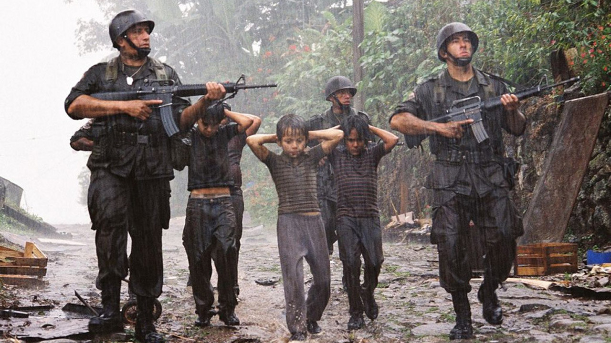
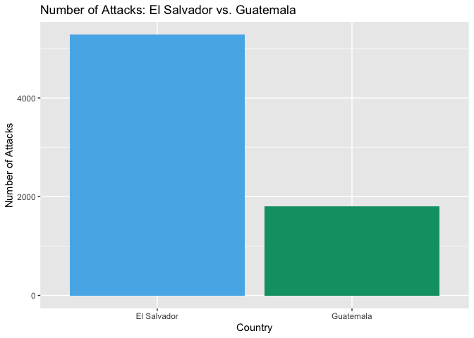
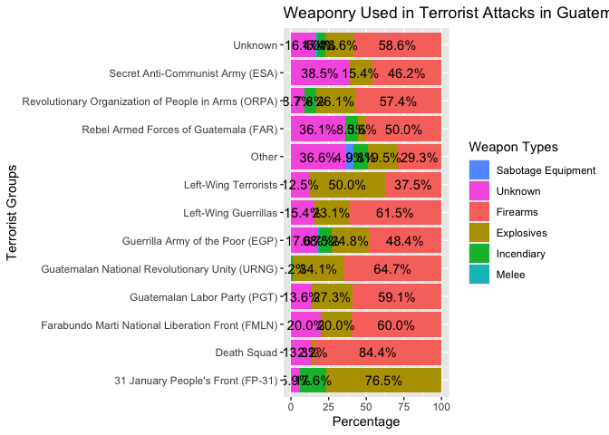

Terrorism in Guatemala and El Salvador (1970-2017)
================
Chelsea Linares
2024-03-13



``` r
GT<-read.csv("~/downloads/globalterrorismdb_0718dist.csv")
```

## Clean-Up Data

Our dataset is global so we will tidy it to only display attacks that
occurred in Guatemala and El Salvador. Since there is around 135
variables, many of which are redundant or unnecessary for our analysis,
we will remove them. To make our visuals clearer, I merged some
of the smaller terrorist groups together into an ‘Other’ category, as
these groups had far fewer attacks compared to others. After these adjustments,
we will be left with 26 crucial variables.

``` r
#only use data from Guatemala and El Salvador
#region 2= carribean and latin america
GT<-GT %>%
  filter(region=='2', country_txt=='Guatemala'|country_txt=='El Salvador')

#removing columns
GT<-GT[ , colSums(is.na(GT))<.1] 

#factor
GT$gname<- fct_lump_min(GT$gname, min=15, other_level = "Other")

GT<-GT[c(1,2,3,4,6,8,9,12,13,23,24,26,27,30,31,33,45,57,58,59,66,67,68,70,72,74)] #predictors to keep
#only 28 variables remaining

#turn into characters
GT$eventid<-as.character(GT$eventid)
GT$imonth<-as.character(GT$imonth)
GT$iyear<-as.character(GT$iyear)
GT$iday<-as.character(GT$iday)
GT$country<-as.character(GT$country)
GT$ishostkid<-as.character(GT$ishostkid)
```

### Defining our Variables

My variables are as follows:

`eventid`: a 12-digit number assigned by a system dedicated to identify
each attack. The first 8 digits is the date recorded, YYYYMMDD, while
the last 4 digits is the sequential.

`iyear`: the year the attack occurred.

`imonth`: the month the attack occurred.

`iday`: the day the attacked occurred.

`extended`: whether the duration of the incident lasted for over 24
hours. (e.g 1=Yes, 0=No)

`country`: the country code where the incident occurred.

`country_txt`: the name of the country or location where the attack
occurred.

`provstate`: the province or state where the attack occurred.

`city`: the name of the city, village, or town where the incident
occurred.

`multiple`: whether the attack was part of a multiple incident. (e.g
1=Yes, 0=No)

`success`: whether the attack was successful or not. This is judge on
tangible effects of the attack and not the larger goals of the
perpetrators.

`attacktype1`: the numeric method of the attack (e.g 1=Assassination,
2=Armed Assault, etc.)

`attacktype1_txt`: the name of the attack.

`targtype1`: a number use to indicate the general type of target/victim
in the attack.

`targtype1_txt`: the name of the general type of target/victim in the
attack.

`target1`: a specific person, building, or installation that was
targeted in the incident

`gname`: name of the terrorist group who attacked.

`weaptype1`: a number use to indicate the weapon type used in the
attack.

`weaptype1_txt`: the name of the weapon type used in the attack.

`weapsubtype1_txt`: further details of subtypes for each primary weapon
type.

`weapdetail`: types of weapons used in the attack.

`property`: whether there was property damage from the attack. (e.g
1=Yes, 0=No, -9=Unknown)

`propextent_txt`: the extent of the property damage. Classified under 4
categories: Catastrophic (likely \>1 billion), Major (likely \>1 million
but \<1 billion), Minor (likely \<1 million), or Unknown.

`ishostkid`: whether or not the victim was taken as hostage or kidnapped
during the incident.

`kidhijcountry`: the country in which the hostage taking or hijacking
was resolved or ended.

`hostkidoutcome_txt`: the outcome of hostages or kidnap victims if there
are any during the attacks.

## Visualizations

### Distribuation of Attacks

``` r
GT %>%
ggplot(aes(country_txt))+geom_bar(fill=c('#56B4E9', '#009E73'))+labs(y="Number of Attacks",x="Country",title="Number of Attacks in each Country")
```

<!-- -->

``` r
GT%>%
  filter(country_txt=='El Salvador')%>%
  count(gname)
```

    ##                                               gname    n
    ## 1        Armed Forces of National Resistance (FARN)   38
    ## 2                                       Death Squad   58
    ## 3  Farabundo Marti National Liberation Front (FMLN) 3330
    ## 4          February 28 Popular League (El Salvador)   15
    ## 5                              Left-Wing Guerrillas   18
    ## 6                              Left-Wing Terrorists   17
    ## 7                  People's Liberation Forces (FPL)  167
    ## 8   People's Revolutionary Army (ERP) (El Salvador)   64
    ## 9                  Popular Revolutionary Bloc (BPR)   38
    ## 10                 Secret Anti-Communist Army (ESA)    6
    ## 11                                          Unknown 1458
    ## 12                                            Other  111

``` r
GT%>%
  filter(country_txt=='Guatemala')%>%
  count(gname)
```

    ##                                                  gname    n
    ## 1                    31 January People's Front (FP-31)   17
    ## 2                                          Death Squad   69
    ## 3     Farabundo Marti National Liberation Front (FMLN)    5
    ## 4                         Guatemalan Labor Party (PGT)   22
    ## 5       Guatemalan National Revolutionary Unity (URNG)  131
    ## 6                     Guerrilla Army of the Poor (EGP)  155
    ## 7                                 Left-Wing Guerrillas   14
    ## 8                                 Left-Wing Terrorists    8
    ## 9                Rebel Armed Forces of Guatemala (FAR)   36
    ## 10 Revolutionary Organization of People in Arms (ORPA)  115
    ## 11                    Secret Anti-Communist Army (ESA)   13
    ## 12                                             Unknown 1413
    ## 13                                               Other   52

This bar graph shows that from 1970 to 2017, El Salvador experienced significantly more attacks than Guatemala, with over
double the amount of recorded incidents. This is important because it highlights the need to compare the data using percentages.

The FMLN drove El Salvador’s attacks exponentially with
them contributing to 3330 recorded attacks. While both El Salvador and
Guatemala had a FMLN group, it appears to have been much more active in El
Salvador. My parents, who grew up in El Salvador around that time
described it as a bloodbath-many families fled, 
only to be shot in front of their children. I imagine the situation in
Guatemala is similar especially considering the imagery depicted in *The Tattooed
Soldier*. Thus, the fact that only 5 FMLN attacks are recorded in Guatemala
leads me to believe this data might be skewed or incomplete.

### Correlation Between Variables

``` r
#correlation between predictors
cor_GT<- GT %>%
  correlate()
```

    ## Non-numeric variables removed from input: `eventid`, `iyear`, `imonth`, `iday`, `country`, `country_txt`, `provstate`, `city`, `attacktype1_txt`, `targtype1_txt`, `target1`, `gname`, `weaptype1_txt`, `weapsubtype1_txt`, `weapdetail`, `propextent_txt`, `ishostkid`, `kidhijcountry`, and `hostkidoutcome_txt`
    ## Correlation computed with
    ## • Method: 'pearson'
    ## • Missing treated using: 'pairwise.complete.obs'

``` r
  stretch(cor_GT) %>%
  ggplot(aes(x,y,fill=r))+geom_tile() +
  geom_text(aes(label = as.character(fashion(r))))
```

<!-- -->

Through this graph, we see the type of weapon used is strongly
correlated with the type of attack. This is to be expected considering
depending on the attack they want to enact, it determines the kinds of
weapons they can use. However, I was not expecting the target victim to
correlate with multiple. This means that if victims were attacked for
specific reasons, it could determine whether this attack is part of a
multiple incident.

### Bar Plot on Victims who were Kidnapped

``` r
GT %>% 
  count(gname, ishostkid)%>%
  group_by(gname) %>% 
  mutate(count=prop.table(n)*100) %>%
  ggplot(aes(x=gname, y=count, fill=ishostkid))+geom_bar(stat="identity")+ geom_text(aes(label=paste0(sprintf("%1.1f",count),"%")),position=position_stack(vjust = .5))+theme_bw()+labs(y="Percentage",x="Terrorist Groups", )+coord_flip()+scale_fill_discrete(name="Victim Kidnapped", breaks=c(0,1), labels=c("No", "Yes"))
```

<!-- -->

This distribution is incredibly terrifying, especially since February 28
Popular League and FARN held hostages or kidnapped people in more than half
of their attacks. It seems they primarily targeted innocent civilians to get what
they wanted.

What shocked me further was discovering FMLN only kidnapped people 4.9% of
the time. I was under the impression kidnapping was one of their primarily attack methods. My parents claimed the FMLN would often kidnap children, forcing
them to join their army or face execution. From what
they saw the military only drafted adults, while the FMLN targeted children for recruitment.

### Comparing Same Terrorist Group in Each Country

``` r
GT %>% mutate(country_txt=factor(country_txt, levels = c("Guatemala","El Salvador")),
              attacktype1=factor(attacktype1, levels=(9:1), labels=(c('Unknown','Unarmed Assault', 'Facility/Infrastructure Attack', 'Hostage Taking (Kidnapping)', 'Hostage Taking (Barricade Incident)','Hijacking', 'Bombing/Explosion', 'Armed Assault', 'Assassination'))), gname=factor(gname, levels = c("Death Squad","Left-Wing Terrorists", "Left-Wing Guerrillas", "Farabundo Marti National Liberation Front (FMLN)"), labels=c('Death Squad', 'L-W Terrorist', 'L-W Guerrillas', "FMLN"))) %>%
  group_by(country_txt,gname,attacktype1) %>% summarise(N=n()) %>% ungroup() %>%
  group_by(country_txt,gname) %>% 
  mutate(Total=sum(N),Percent=N/Total,
         Lab=paste0(N,' (',paste0(round(100*Percent,0),'%'),')')) -> Sums
```

    ## `summarise()` has grouped output by 'country_txt', 'gname'. You can override
    ## using the `.groups` argument.

``` r
#Plot
Sums<-Sums[ rowSums(is.na(Sums))<.1,] 
ggplot(Sums,aes(x=country_txt,y=Percent,fill=attacktype1))+geom_bar(stat='identity',position = position_stack())+facet_wrap(.~gname)+geom_text(aes(label=Lab),position = position_stack(vjust = .5),size=2)+labs(x="Country", title = "Distribution of Terrorist Groups Based on Each Country")
```

<!-- -->

It appears Death Squad was equally active in both
countries, continuously using the same types of attacks.
However, Left-Wing Terrorist and Left-Wing Guerrillas both used different attacks
depending on the country. Despite being 2 separate groups, they (L-W
Guerrillas & L-W Terrorist) used similar attacks in the same country. I
believe this is due to the different environments-groups likely tailored their attacks to have a stronger impact on local population. 

The FMLN is hard to discuss considering there’s great discrepancies
in the number of attacks.

### Distribution of Weapon Types Used in Guatemala

``` r
GT$weaptype1<-as.character(GT$weaptype1)
GT %>% 
  filter(country_txt=='Guatemala')%>%
  count(gname, weaptype1)%>%
  group_by(gname) %>% 
  mutate(count=prop.table(n)*100) %>%
  ggplot(aes(x=gname, y=count, fill=weaptype1))+geom_bar(stat='identity')+  geom_text(aes(label=paste0(sprintf("%1.1f",count),"%")),position=position_stack(vjust = .5))+labs(y="Percentage",x="Group who Attacked",title="Weapon Types Used In Attacks In Guatemala ")+coord_flip()+scale_fill_discrete(name="Weapon Types", breaks=c(10, 11,13, 5, 6,8,9), labels=c("Vehicle", "Sabotage Equipment", "Unknown", "Firearms", "Explosives","Incendiary", "Melee"))
```

<!-- -->

In Guatemala, the most common weapon used in attacks was firearms, with explosives
coming in second. The FP-31 group, in particular, seems to have favored explosives-76.5% of their attacks involved them. While all forms of
violence are horrific, choosing explosives feels particularly charged, to me it suggests an
extra layer of anger and resentment behind their actions.
