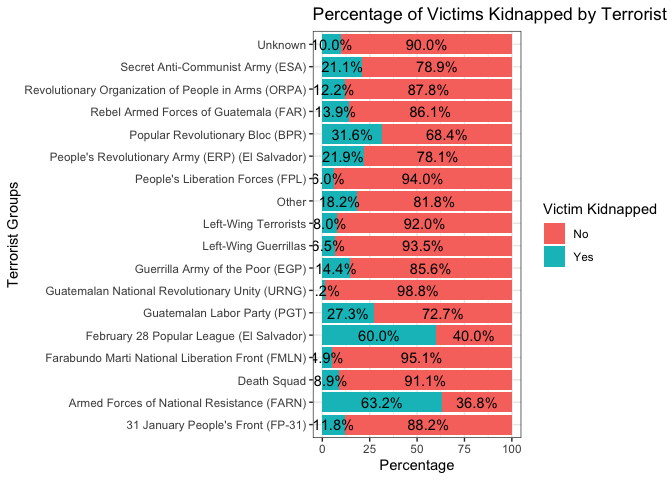

Terrorism in Guatemala and El Salvador (1970-2017)
================
Chelsea Linares
2024-03-13


``` r
GT<-read.csv("~/downloads/globalterrorismdb_0718dist.csv")
```

## Clean-Up Data

Our data is nationwide so we will tidy it to only display attacks that
happened in Guatemala and El Salvador. Also, there’s around 135
variables, many of which are redundant or unnecessary for our analysis
so we will scrape them. Just to make our visuals clearer, I merged some
of the terrorist groups together into an ‘Other’ category because there
were few times this group attacked compared to other groups. At the end,
we remain with 26 variables.

``` r
#only use data from Guatemala and El Salvador
#region 2= carribean and latin america
GT<-GT %>%
  filter(region=='2', country_txt=='Guatemala'|country_txt=='El Salvador')

#removing columns with less than 10% data
GT<-GT[ , colSums(is.na(GT))<.1] 

#only keep top 15 terrorist groups, the rest lump into an other category
GT$gname<- fct_lump_min(GT$gname, min=15, other_level = "Other")

GT<-GT[c(1,2,3,4,6,8,9,12,13,23,24,26,27,30,31,33,45,57,58,59,66,67,68,70,72,74)] #predictors to keep

#turn into characters and factor
GT$eventid<-as.factor(GT$eventid)
GT$imonth<-as.factor(GT$imonth)
GT$iyear<-as.factor(GT$iyear)
GT$iday<-as.factor(GT$iday)
GT$extended<-as.factor(GT$extended)
GT$country<-as.factor(GT$country)
GT$country_txt<-as.character(GT$country_txt)
GT$provstate<-as.character(GT$provstate)
GT$city<-as.character(GT$city)
GT$multiple<-as.factor(GT$multiple)
GT$success<-as.factor(GT$success)
GT$attacktype1<-as.factor(GT$attacktype1)
GT$attacktype1_txt<-as.character(GT$attacktype1_txt)
GT$targtype1<-as.factor(GT$targtype1)
GT$targtype1_txt<-as.character(GT$targtype1_txt)
GT$gname<-as.factor(GT$gname)
GT$weaptype1<-as.factor(GT$weaptype1)
GT$property<-as.factor(GT$property)
GT$ishostkid<-as.factor(GT$ishostkid)
GT$kidhijcountry<-as.character(GT$kidhijcountry)
```

### Defining Variables

My variables are as follows:

`eventid`: a 12-digit number assigned by a system dedicated to identify
each attack. The first 8 digits is the date recorded, YYYYMMDD, while
the last 4 digits is the sequential.

`iyear`: the year the attack occurred.

`imonth`: the month the attack occurred.

`iday`: the day the attacked occurred.

`extended`: whether the duration of the incident lasted for over 24
hours. (e.g 1=Yes, 0=No)

`country`: the country code where the incident occurred.

`country_txt`: the name of the country or location where the attack
occurred.

`provstate`: the province or state where the attack occurred.

`city`: the name of the city, village, or town where the incident
occurred.

`multiple`: whether the attack was part of a multiple incident. (e.g
1=Yes, 0=No)

`success`: whether the attack was successful or not. This is judge on
tangible effects of the attack and not the larger goals of the
perpetrators.

`attacktype1`: the numeric method of the attack (e.g 1=Assassination,
2=Armed Assault, etc.)

`attacktype1_txt`: the name of the attack.

`targtype1`: a number use to indicate the general type of target/victim
in the attack.

`targtype1_txt`: the name of the general type of target/victim in the
attack.

`target1`: a specific person, building, or installation that was
targeted in the incident

`gname`: name of the terrorist group who attacked.

`weaptype1`: a number use to indicate the weapon type used in the
attack.

`weaptype1_txt`: the name of the weapon type used in the attack.

`weapsubtype1_txt`: further details of subtypes for each primary weapon
type.

`weapdetail`: types of weapons used in the attack.

`property`: whether there was property damage from the attack. (e.g
1=Yes, 0=No, -9=Unknown)

`propextent_txt`: the extent of the property damage. Classified under 4
categories: Catastrophic (likely \>1 billion), Major (likely \>1 million
but \<1 billion), Minor (likely \<1 million), or Unknown.

`ishostkid`: whether or not the victim was taken as hostage or kidnapped
during the incident.

`kidhijcountry`: the country in which the hostage taking or hijacking
was resolved or ended.

`hostkidoutcome_txt`: the outcome of hostages or kidnap victims if there
are any during the attacks.

## Visualizations

Let’s do a chi-square test to see if the attack frequencies between
Guatemala and El Salvador are proportionate.

``` r
# chi-square test
GS<-table(GT$country)
chisq.test(GS)
```

    ## 
    ##  Chi-squared test for given probabilities
    ## 
    ## data:  GS
    ## X-squared = 1450.9, df = 1, p-value < 2.2e-16

Since the p-value \< .05, we reject the null hypothesis. This indicates
there is a significant difference in the frequency of attacks between
both countries. Let’s dive deeper and visualize the attack frequencies
for both countries.

### Distribuation of Attacks

``` r
GT %>%
ggplot(aes(country_txt)) + geom_bar(fill=c('#56B4E9', '#009E73')) + 
  labs(y="Number of Attacks",x="Country",title="Number of Attacks: El Salvador vs. Guatemala")
```

<!-- -->

``` r
GT%>%
  filter(country_txt=='El Salvador')%>%
  count(gname)
```

    ##                                               gname    n
    ## 1        Armed Forces of National Resistance (FARN)   38
    ## 2                                       Death Squad   58
    ## 3  Farabundo Marti National Liberation Front (FMLN) 3330
    ## 4          February 28 Popular League (El Salvador)   15
    ## 5                              Left-Wing Guerrillas   18
    ## 6                              Left-Wing Terrorists   17
    ## 7                  People's Liberation Forces (FPL)  167
    ## 8   People's Revolutionary Army (ERP) (El Salvador)   64
    ## 9                  Popular Revolutionary Bloc (BPR)   38
    ## 10                 Secret Anti-Communist Army (ESA)    6
    ## 11                                          Unknown 1458
    ## 12                                            Other  111

``` r
GT%>%
  filter(country_txt=='Guatemala')%>%
  count(gname)
```

    ##                                                  gname    n
    ## 1                    31 January People's Front (FP-31)   17
    ## 2                                          Death Squad   69
    ## 3     Farabundo Marti National Liberation Front (FMLN)    5
    ## 4                         Guatemalan Labor Party (PGT)   22
    ## 5       Guatemalan National Revolutionary Unity (URNG)  131
    ## 6                     Guerrilla Army of the Poor (EGP)  155
    ## 7                                 Left-Wing Guerrillas   14
    ## 8                                 Left-Wing Terrorists    8
    ## 9                Rebel Armed Forces of Guatemala (FAR)   36
    ## 10 Revolutionary Organization of People in Arms (ORPA)  115
    ## 11                    Secret Anti-Communist Army (ESA)   13
    ## 12                                             Unknown 1413
    ## 13                                               Other   52

With this bar graph, we see that from 1970-2017 there were significantly
more attacks in El Salvador than Guatemala. El Salvador had more than
double the amount of attacks. Its good to know because now when we
compare country differences using percentages.

The terrorist group FMLN drove El Salvador’s attacks exponentially with
them contributing to 3330 recorded attacks. Though, both El Salvador and
Guatemala had an FMLN group, it seems to have been more full force in El
Salvador. My parents grew up in El Salvador around that time and they
described it as a blood bath. Many parents ran away with their families
only to be shot in front of their kids. I imagine it was similar in
Guatemala especially considering the imagery depicted in *The Tattooed
Soldier*. Thus, seeing there’s only 5 recorded FMLN attacks in Guatemala
leads me to believe this data might be heavily skewed.

### Kidnapping Incidents Across Terrorist Groups

``` r
GT %>% 
  count(gname, ishostkid)%>%
  group_by(gname) %>% 
  mutate(count=prop.table(n)*100) %>%
  ggplot(aes(x=gname, y=count, fill=ishostkid))+geom_bar(stat="identity")+     geom_text(aes(label=paste0(sprintf("%1.1f",count),"%")),                                       position=position_stack(vjust = .5)) + theme_bw() +
  labs(y="Percentage",x="Terrorist Groups", title="Percentage of Victims Kidnapped by Terrorist Groups") + 
  coord_flip() +
  scale_fill_discrete(name="Victim Kidnapped", breaks=c(0,1), labels=c("No", "Yes"))
```

<!-- -->

This distribution is incredibly terrifying especially since February 28
Popular League and FARN held hostages or kidnapped people for over half
of their attacks. It seems they targeted innocent civilians to get what
they wanted.

However, it further shocked me to see FMLN only kidnapped people 4.9% of
the time. I was under the impression this was one of their main forms of
attack. My parents claimed the FMLN would kidnapped children and force
them to join their army or they would be killed. They stated from what
they saw the military didn’t draft children, just adults but the FMLN
did.

### Exploring the Weapon Types Used in Guatemala

``` r
GT %>% 
  filter(country_txt=='Guatemala')%>%
  count(gname, weaptype1)%>%
  group_by(gname) %>% 
  mutate(count=prop.table(n)*100) %>%
  ggplot(aes(x=gname, y=count, fill=weaptype1))+geom_bar(stat='identity')+    
  geom_text(aes(label=paste0(sprintf("%1.1f",count),"%")), 
  position=position_stack(vjust = .5)) + labs(y="Percentage",x= "Terrorist Groups",title="Weaponry Used in Terrorist Attacks in Guatemala ") + 
  coord_flip()+ scale_fill_discrete(name="Weapon Types", 
  breaks=c(10, 11,13, 5, 6,8,9), labels=c("Vehicle", "Sabotage Equipment", "Unknown", "Firearms", "Explosives","Incendiary", "Melee"))
```

<!-- -->

The most common weapon used in Guatemala is firearms, with explosives
coming in second. FP-31 seems like explosives was their weapon of
choice, 76.5% of their attacks were explosive attacks. All manners of
hurting people are awful, but to choose explosives, I think there’s an
extra layer of anger and resentment to use that.

### Breakdown of Attack Types by Terrorist Group in Guatemala and El Salvador

``` r
GT %>% mutate(country_txt=factor(country_txt, levels = c("Guatemala","El Salvador")),
              attacktype1=factor(attacktype1, levels=(9:1), labels=(c('Unknown',
              'Unarmed Assault', 'Facility/Infrastructure Attack', 'Hostage Taking (Kidnapping)', 'Hostage Taking (Barricade Incident)','Hijacking', 
              'Bombing/Explosion', 'Armed Assault', 'Assassination'))), 
              gname=factor(gname, levels = c("Death Squad","Left-Wing Terrorists", 
                                             "Left-Wing Guerrillas", "Farabundo Marti National Liberation Front (FMLN)"), 
                           labels=c('Death Squad', 'L-W Terrorist', 'L-W Guerrillas', "FMLN"))) %>%
  group_by(country_txt,gname,attacktype1) %>% summarise(N=n()) %>% ungroup() %>%
  group_by(country_txt,gname) %>% 
  mutate(Total=sum(N),Percent=N/Total,
         Lab=paste0(N,' (',paste0(round(100*Percent,0),'%'),')')) -> Sums
```

    ## `summarise()` has grouped output by 'country_txt', 'gname'. You can override
    ## using the `.groups` argument.

``` r
Sums<-Sums[rowSums(is.na(Sums))<.1,] 
#plot
ggplot(Sums,aes(x=country_txt,y=Percent,fill=attacktype1)) +
  geom_bar(stat='identity',position =  position_stack()) + facet_wrap(.~gname) + geom_text(aes(label=Lab), position = position_stack(vjust = .5),size=2) + 
  labs(x="Country", title = "Terrorist Groups and Their Attack Types in
       Guatemala & El Salvador") + scale_fill_discrete(name="Attack Type")
```

<!-- -->

It appears Death Squad was equally active in both Central American
countries and they continuously used the same types of attacks.
Left-Wing Terrorist and Left-Wing Guerrillas both used different attacks
based on the country. However despite being 2 separate groups they \[L-W
Guerrillas & L-W Terrorist\] use similar attacks in the same country. I
believe this is due to the different environments, groups would commit
attacks that would have a bigger impact in the country and among the
people. FMLN is hard to discuss considering there’s great discrepancies
in the number of attacks.

### Terrorist Attacks over Time (Time Series Plot)

``` r
GT2 <- GT %>%
  group_by(iyear, imonth, country) %>%
  summarise(attack_count = n(), .groups = 'drop') %>%
 mutate(year_month = as.Date(paste(iyear, imonth,"01", sep = "-"))) # create a date column

#turn binary country into text
GT2$country<-factor(GT2$country,levels = c(61, 83), labels = c("El Salvador", "Guatemala"))

#plot the time series
ggplot(GT2, aes(x = year_month, y = attack_count, color = country, group = country)) +
  geom_line(size = 1) +  
  labs(
    title = "Monthly Frequency of Terrorist Attacks",
    x = "Year",
    y = "Number of Attacks"
  )  + theme_minimal()+
  scale_x_date(date_labels = "%Y", date_breaks = "1 year") + 
  scale_color_manual(values=c("El Salvador"="#56B4E9","Guatemala"="#009E73")) +
  guides(color = guide_legend(title = "Country")) +  # name the legend
  theme(axis.text.x = element_text(angle = 45, hjust = 1))
```

    ## Warning: Using `size` aesthetic for lines was deprecated in ggplot2 3.4.0.
    ## ℹ Please use `linewidth` instead.
    ## This warning is displayed once every 8 hours.
    ## Call `lifecycle::last_lifecycle_warnings()` to see where this warning was
    ## generated.

    ## Warning: Removed 1 row containing missing values or values outside the scale range
    ## (`geom_line()`).

<!-- -->

From the data, I plotted the frequency of attacks per month (from
1970-2017) in Guatemala and El Salvador. As anticipated, El Salvador had
a greater average of attacks than Guatemala. However, I was shocked
about the huge spike of attacks in Guatemala around 1982. I would like
to do more research to see what events led to this spike.
